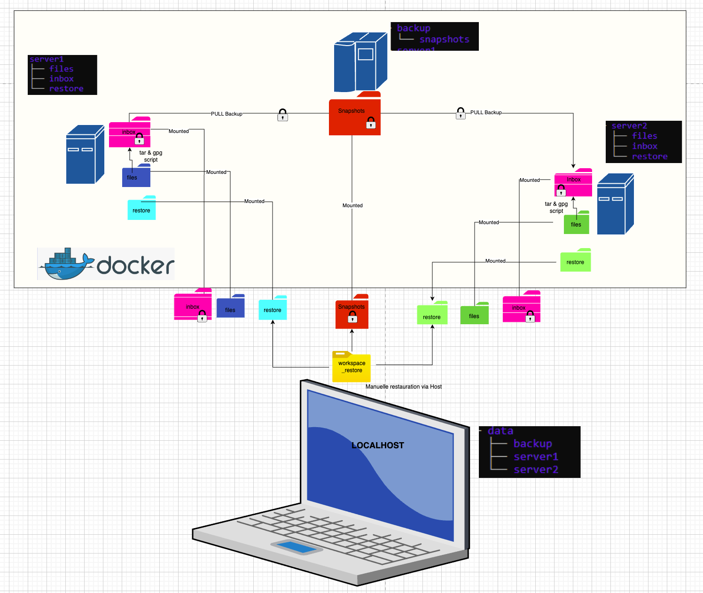

# Automated & Secure Backup Project

This project implements a complete, secure, and containerized backup strategy, meeting the requirements of modern system architecture.

## Statement & Objectives (The Original "Recipe")

The objective was to set up a robust backup/restore strategy using standard Linux tools, including a retention policy:
* **Cron**: Task scheduling.
* **Rsync / SSH**: Secure synchronization.
* **GPG**: Backup encryption.
* **Tar**: Compression.
* **Rsnapshot:** Management of GFS (Grandfather-Father-Son) retention.


## Solution Architecture

We have industrialized this "recipe" by using **Docker** to simulate a real infrastructure composed of 3 independent machines.



### Components
1. **Backup Server (Rsnapshot)**: The orchestrator. It initiates the connection (Pull), retrieves archives, and manages history (snapshot rotation).
2. **Client Servers (Server1 & Server2)**: Data sources. They execute a local script to compress and encrypt data ready to be pulled..
3. **Localhost (Host)**: The administrator machine, used to manage keys, store persistent volumes, and perform manual restorations.

---

## Important: Technical Analysis of Deduplication

In this specific version of the project, **Hardlinks (deduplication) are NOT effective**, even if Rsnapshot is used. 

**Reason:**
* **GPG Entropy**: Each time the `make_archive.sh` script runs, GPG adds a random salt/IV to the encryption. Even if the source files are identical, the resulting `.gpg` file is binary-different every time.
* **File Recreation**: Since the archive is recreated before each pull, it gets a new Inode on the client side.
* **Result**: Rsnapshot sees a "new" file and downloads it entirely. Each snapshot (alpha.0, alpha.1, etc.) consumes full disk space.

*Note: For a version supporting full deduplication, see the `rsnapshot-luks` repository.*
[Project Rsnapshot-LUKS](https://github.com/TsamD/rsnapshot-luks.git)

---

## Installation and Startup

### 1. Prerequisites
* Docker & Docker Compose installed.
* SSH and GPG keys generated (provided in the `config` folder for this project).

### 2. Startup
The environment is pre-configured. Data folders (`files`, `inbox`, `restore`) are automatically initialized.

```bash
# Start the infrastructure
docker compose up -d --build

```

# Backup & Restore – Command Recap

## Rsnapshot Configuration Check

```bash
docker exec -it backup rsnapshot configtest
````

---

## Test Backup (Dry Run)

```bash
docker exec -it backup rsnapshot -t alpha
```

---

## Run Backup

```bash
docker exec -it backup rsnapshot alpha
```

---

## Verify Dates Snapshots

```bash
docker exec -it backup ls -l snapshots/
```

## Verify Latest Snapshot

```bash
docker exec -it backup ls -R snapshots/alpha.0/
```

---

## Check Logs

Show last 50 lines:

```bash
docker exec -it backup tail -n 50 /var/log/rsnapshot.log
```

Follow logs live:

```bash
docker exec -it backup tail -f /var/log/rsnapshot.log
```

---

# Restore Procedure

## 1. Prepare Workspace (Host)

```bash
rm -rf workspace_restore/*
cd workspace_restore
```

---

## 2. Copy Encrypted Archive from Snapshot

```bash
cp ../data/backup/snapshots/alpha.0/server1/server1files/inbox/backup.tar.gz.gpg .
```

---

## 3. Decrypt Archive

Using stored passphrase:

```bash
gpg --batch --yes --passphrase "$(cat ../config/cron/passphrase)" -o restore.tar.gz -d backup.tar.gz.gpg
```

Or interactive mode:

```bash
gpg -o restore.tar.gz -d backup.tar.gz.gpg
```

---

## 4. Extract Archive

```bash
tar -xzf restore.tar.gz
```

---

## 5. Verify Restored Files

```bash
find . -type f
```

---

## 6. Inject File Back to Server Volume

```bash
cp ./path/to/contract.txt ../data/server1/restore/
```

---

## 7. Verify Inside Container

```bash
docker exec -it server1 ls -R /server1files/restore/
```

```

---


